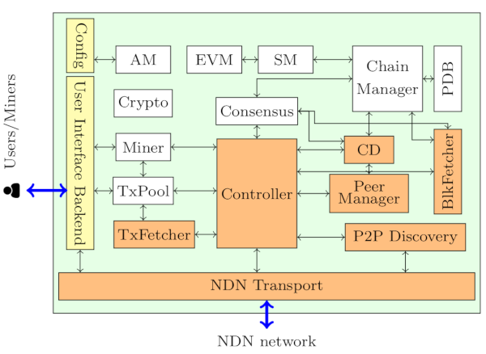

# Go Ethereum blockchain client on NDN (ndn-geth)

## Overview

ndn-geth is an adaptation of the [Go Ethereum](https://geth.ethereum.org/) client to the [Named Data
Networking](https://named-data.net/) infrastructure.

NDN is a newly proposed achitechture for the future Internet. It is one (most
mature) of several realizations of the ICN (Information Centrict Networking)
concept. The idea was to make its network protocol look like Http where you can pull a
piece of content without knowing who is serving it. Network packets
are given names such as */ndn/etri/videos/blockchain-lecture.mp4/1*. Network
routing is based on packet names. Routers may cache data packets to serve
subequent data requests for same named packets. Thus, NDN (ICN in general) can
support content distribution much better than current IP networks.

Overview of NDN can be read from [here](https://named-data.net/wp-content/uploads/2014/10/named_data_networking_ccr.pdf).

And its implementation can be found [here](https://github.com/named-data/ndn-cxx)

There are a few motivations to build an Ethereum blockchain on NDN:
 
 1. Can blockchain take benefit from NDN content delivery supports?
 2. Supporting blockchain research (consensus, security) on ICN/NDN
 3. Supporting blockchain use cases (smartcontract based applications) on ICN/NDN 


Adaptation to NDN means whole transport layer of the ethereum client must be
replaced by an NDN-based counter part. The work includes:

1. A new Kademlia P2P overlay is
implemented using NDN transport
2. A new chain synchronization protocol must be designed and implemented
3. A new blockchain data delivery protocol is designed and implemented. 

Details of design and implementation of ndn-geth can
be found on [this manuscript](docs/geth-ndn-manuscript.pdf). It was submited to the [Journal of Network and
Computer Applications](https://www.journals.elsevier.com/journal-of-network-and-computer-applications) (submited after minor revisions).

Below figure shows the list of components that were modified (yellow) or added (orange) to replace IP based components.



## Is NDN better than IP in supporting blockchain?

Definitely, the experiments show that. Traffic can be reduced significantly and block delivery is quicker.
Please check the [manuscript](docs/geth-ndn-manuscript.pdf) for the experiment results.

## Compile and Run

### Compile
Simple:

`make geth`

### Running ndn-geth

ndn-geth use the same genesis file as original geth to init a blockchain data
folder.

Before running ndn-geth, make sure you have an instance of NFD running on the
local machine.

Runing ndn-geth in console mode is simple:

`geth --datadir {blockchain-dir} --ndnhostname /ndn/etri --ndnsocketname
/var/run/nfd.sock`

The option `--ndnhostname` specifies the NDN name of the running NFD.
In the case where multiple instances of ndn-geth are running on the same machine
with a single NFD, they should use different names with the same prefix, for
example `/ndn/etri/node1`, `/ndn/etri/node2` etc.

The option `--ndnsocket` specifies the address of the unix socket used by the running
NFD. Its default value is `/var/run/nfd.sock` (as specified in the NFD
configuration file). The option should be set accordingly to the NFD
configuration if you are running multiple NFDs on the same machine (for experiment purpose, i.e.)

### Bootstraping

A node must have a list of bootstraping peers to connect when it first joins the network. The list is prepared in a `bootnodes.json` file which should be put in the chain data folder. Below is an example which has a single bootstraping peer. The `Prefix` is the NDN name of the peer (`--ndnhostname`) while `Id` is its identity. The identity of a bootstraping node can be retrieved by searching on the first few lines of its running console.

```
[{
  "Prefix": "/dcn/daejeon/bc/node1",
  "Id": "6813b126937480c9f3365882e77c2fa0af9ab289"
}
]
```
### Demo

I made this video for an online demo talk.

[](https://www.youtube.com/watch?v=m13VEiG0hcE)


## Todos:

1. Chain synchronization is still buggy

3. Light client is not supported. (Need to design a new NDN-based data delivery protocol for light client)


## Credits

ndn-geth is designed and developed by:
- Quang Tung Thai (tqtung@gmail.com)

This work is one of research results of the project "Hyper-connected
Intelligent Infrastructure Technology Development" conducted by ETRI, Korea.
The project leaders are:

- Namseok Ko (nsko@etri.re.kr)
- Sun Me Kim (kimsunme@etri.re.kr)

